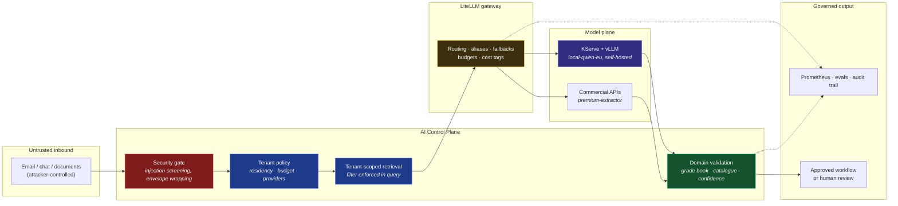
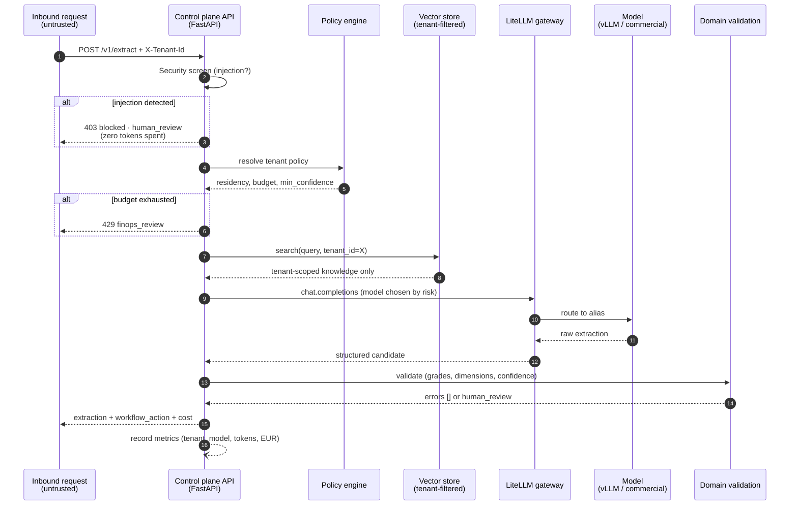
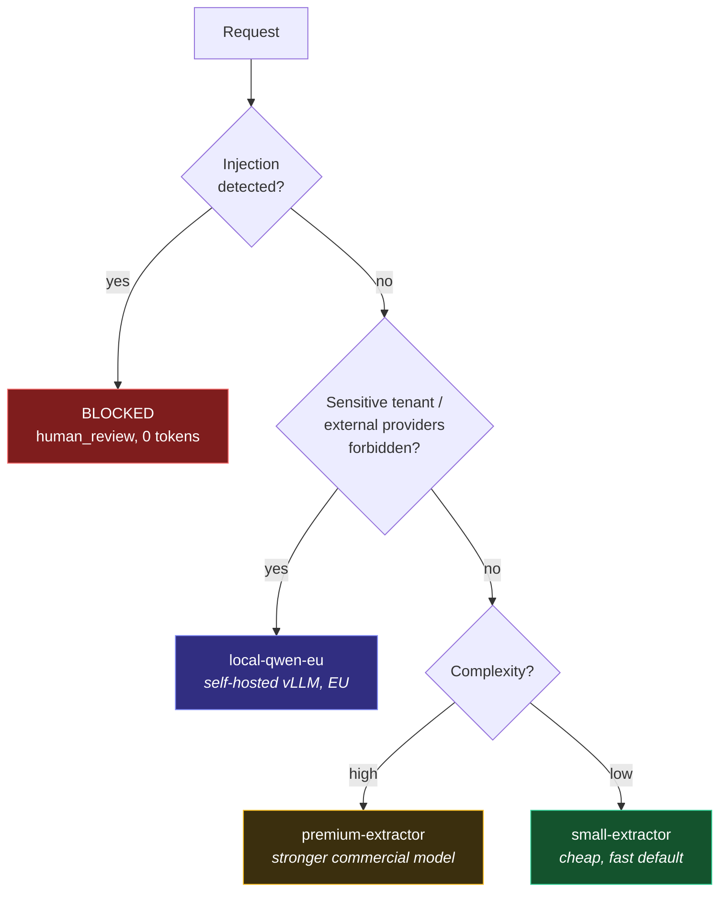
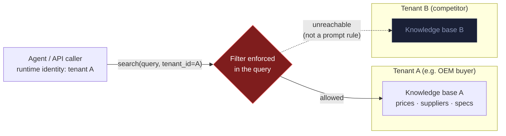
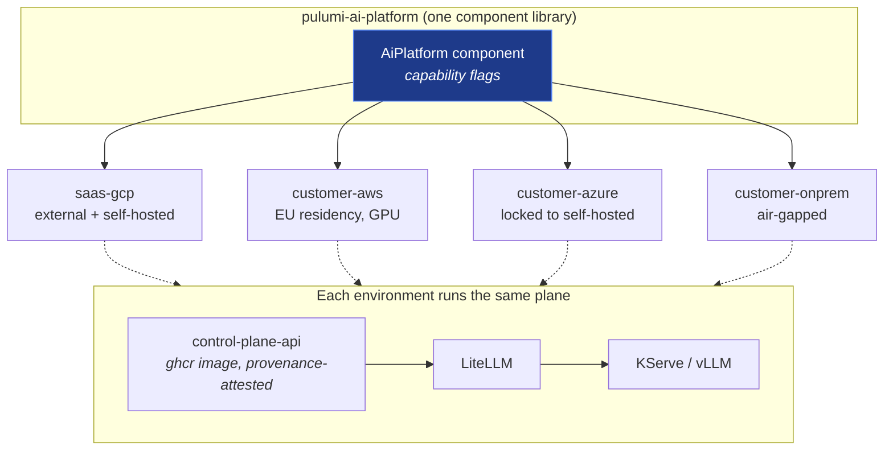

# Architecture

> **Design thesis:** AI demos are easy. The hard part is making AI trustworthy enough
> to trigger real business actions. The LLM proposes; the platform decides.

## High-level architecture

## One request, end to end

## Risk-based model routing

Simple requests default to the cheapest model; sensitivity overrides everything.
Residency is a **policy flag, not a fork** of the platform.

## Tenant isolation model

Tenants may be **competitors of each other**. Isolation is enforced in the
retrieval filter and the runtime identity (the MCP server binds its tenant at
process start from the environment) — never delegated to model behavior.

## Deployment topology

Four environments, one component, capability flags — **not four platforms**.

## The audit trail (what enterprise customers buy)

Every request emits, atomically:

| Field | Why an auditor cares |
|-------|----------------------|
| `tenant` | Whose data, whose budget, whose policy |
| `model` + gateway alias | Which system produced the proposal |
| `workflow_action` | The platform's decision (approve / human_review / blocked) |
| `validation_errors` | Why the platform doubted the model |
| token usage + `cost_eur` | FinOps attribution in the request path |
| latency | SLO evidence |

This is the evidence chain for ISO 27001 / EU AI Act conversations — and the
Prometheus labels double as the Grafana dashboard dimensions.
